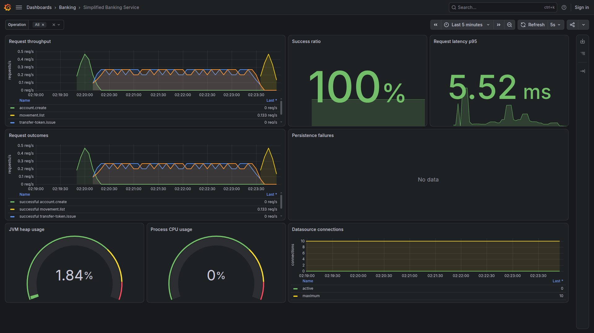

[English](README.md) | [Português](README.pt-BR.md)

# Simplified Banking Service

Simplified Banking Service is a Java/Spring Boot REST API for a deliberately
small digital-banking domain. Its documented scope covers account creation,
safe account-to-account transfers, and bounded account movement history, with
financial consistency and traceability as primary constraints.

The service currently implements account creation, server-issued transfer
idempotency tokens, atomic account-to-account transfers, paginated financial
movement queries, best-effort RabbitMQ notifications, operational metrics, and
automated functional and load-test suites.

## Engineering delivery model

I designed this model of [AI agents](AGENTS.md), [workflows](.agents/workflows/README.md), and [skills](.agents/skills/) using the
experience and software foundations built throughout my career. It accelerates delivery with quality, traceability, and human control at the highest-impact gates.

The solution and delivery process follows this sequence:

1. **Solution design:** understand the problem, product objectives, requirements, flows, constraints, and open decisions.
2. **Durable decisions:** create BDRs for business and product decisions, ADRs for architecture, and update data or engineering standards when needed.
3. **Scope organization:** create epics with their user stories, acceptance criteria, and explicit boundaries.
4. **Execution planning:** create execution plans with ordered slices, risks, test strategy, validations, and resumable checkpoints.
5. **Workflow execution:** Design and Context → Feature Implementation → Quality Gates → AI Code Review → Integrated Functional
   Tests → Finalization and Documentation, all governed by the [engineering standards](docs/engineering/README.md) and
   [Definition of Done](docs/engineering/definition-of-done.md).

Together, these steps keep every change connected to an approved need, supported by objective validation evidence, and subject to
clear human oversight before consequential actions.

### Public delivery evidence

- **Code review:** a dedicated agent reviews changes in [PR #7](https://github.com/ElzioJunior/simplified-banking-service/pull/7),
  [PR #6](https://github.com/ElzioJunior/simplified-banking-service/pull/6), and
  [PR #5](https://github.com/ElzioJunior/simplified-banking-service/pull/5).
- 🕒 **Product development time:** `14h`, from the
  [first commit `d088b38`](https://github.com/ElzioJunior/simplified-banking-service/commit/d088b38f46346c21892f3d753a24c9509e4b0478)
  to the [latest commit `7ef78f4`](https://github.com/ElzioJunior/simplified-banking-service/commit/7ef78f4c740c722e12de90a8e70bf8dd94824280).

## Architecture

- Architecture decisions and their history are indexed in the [Architecture Decision Records](docs/adr/README.md).
- Java 21 and Spring Boot 3.5.16.
- Maven with the Maven Wrapper.
- Spring Web MVC, Bean Validation, Spring Data JPA with Hibernate, MapStruct,
  and Spring Security.
- PostgreSQL 17.6 with immutable Flyway migrations. V1 creates accounts and
  movements, V2 adds transfer idempotency state and the historical outbox, and
  V3 removes the superseded outbox table.
- RabbitMQ 4.1.4 for direct transfer-completed event publication.
- Spring Boot Actuator and Micrometer with Prometheus collection and a
  provisioned Grafana dashboard for local observability.
- Springdoc OpenAPI and Swagger UI for generated interactive REST documentation.
- Docker and Docker Compose for reproducible local environments.
- A layered monorepo with API, mapper, service, repository, entity, DTO, and
  configuration boundaries.
- `BigDecimal` and fixed-precision database types for monetary values.
- A single `READ COMMITTED` transaction with pessimistic account locking for
  each transfer.
- At least 90% unit-test coverage for meaningful application logic, plus
  isolated, integrated, concurrency, migration, and Gatling load tests.

Decision records have mixed statuses. Accepted records govern idempotency,
temporary unauthenticated API access, bounded contention failure, and direct
best-effort notifications; the superseded outbox records remain as history.

## Implemented capabilities

- Create an account with a generated numeric ID, customer name, non-negative
  opening balance, and UTC creation timestamp.
- Normalize monetary values to scale two with `HALF_EVEN` rounding and persist
  them as PostgreSQL `NUMERIC(19,2)` values.
- Issue a server-generated UUID idempotency token that is valid for 10 minutes.
- Transfer a positive monetary amount between two different existing accounts.
- Debit and credit both accounts atomically, without creating or destroying
  money.
- Replay the established result when a completed transfer is retried with the
  same token and normalized payload, without duplicating financial effects.
- Prevent overdrafts, token reuse with another payload, lost updates, and
  partial financial effects under concurrent requests.
- Record each successful transfer as one debit and one credit movement sharing
  the same operation identifier.
- List one account's recent movements in fixed pages of 10 with `1d`, `1w`, or
  `1M` lookback periods and optional `CREDIT`/`DEBIT` filters.
- Lock transfer accounts in ascending ID order inside one `READ_COMMITTED`
  transaction with a configurable lock timeout.
- Request synchronous best-effort publication of a `TRANSFER_COMPLETED` event
  to RabbitMQ after each newly completed transfer commits.
- Expose operational metrics for throughput, latency, failures, timeouts, and
  lock contention.
- Publish the versioned REST contract, principal success and validation
  examples, and an interactive execution surface through OpenAPI and Swagger UI.
- Validate database migrations, real HTTP/PostgreSQL/RabbitMQ behavior,
  concurrency, and sustained load through separate automated test suites.

## Current limitations

- Account retrieval, listing, update, and deletion endpoints are not provided.
- Overdrafts, fees, exchange rates, scheduled transfers, and corrective
  financial operations are outside the current scope.
- `/api/v1/**` is temporarily unauthenticated and excluded from CSRF checks.
  The service must not be exposed to an untrusted network until authentication
  and authorization are implemented.
- RabbitMQ delivery is best effort. There is no outbox, durable retry,
  publisher confirmation, exactly-once guarantee, or recovery after process or
  broker failure.
- No notification consumer or customer-facing delivery channel is included.

## REST API

Public endpoints are versioned under `/api/v1`. After starting the application,
use the canonical interactive documentation for complete request and response
schemas, executable examples, validation cases, and failure contracts:

- Swagger UI: [http://localhost:8080/swagger-ui.html](http://localhost:8080/swagger-ui.html)
- OpenAPI JSON: [http://localhost:8080/v3/api-docs](http://localhost:8080/v3/api-docs)

| Method | Path | Purpose |
| --- | --- | --- |
| `POST` | `/api/v1/accounts` | Create an account |
| `GET` | `/api/v1/accounts/{accountId}/movements` | List a paginated, optionally filtered movement history |
| `POST` | `/api/v1/transfer-tokens` | Issue a 10-minute transfer idempotency token |
| `POST` | `/api/v1/transfers` | Create or idempotently replay an account-to-account transfer |

Swagger UI is the source for the principal successful, empty-result, transport
validation, business conflict, not-found, and temporary-failure examples.
Expected failures use safe RFC 9457 Problem Details.

### Transfer notifications

Each newly completed transfer requests publication of an event containing a
unique event ID, the transfer operation ID, recipient account ID,
`TRANSFER_COMPLETED` type, normalized amount, and occurrence time.

RabbitMQ topology:

- Exchange: `banking.transfer.notifications`
- Queue: `banking.transfer.notifications.completed`
- Routing key: `transfer.completed`

Identical transfer replays do not request another publication. After the
PostgreSQL commit releases financial locks, publication runs synchronously with
finite connection, handshake, channel RPC, attempt-count, and total-duration
bounds. Exhausted attempts do not invalidate the committed transfer. The event
may still be lost if the process stops after commit or duplicated by RabbitMQ
or network behavior.

## Documentation

- [Documentation map](docs/README.md)
- [Core database schema epic](docs/epics/EPIC000-core-database-schema.md)
- [Development execution report](docs/epics/execution-report.md)
- [Account creation epic](docs/epics/EPIC001-account-creation.md)
- [Account-to-account transfer epic](docs/epics/EPIC002-account-to-account-transfer.md)
- [Functional test suite simplification epic](docs/epics/EPIC003-functional-test-suite-simplification.md)
- [Account movement listing epic](docs/epics/EPIC004-account-movement-listing.md)
- [Business decision records](docs/bdr/README.md)
- [Architecture decision records](docs/adr/README.md)
- [Logical data model](docs/database/logical-data-model.md)
- [Engineering standards](docs/engineering/README.md)
- [AI-assisted delivery workflows](.agents/workflows/README.md)

Repository-wide contribution instructions are defined in [AGENTS.md](AGENTS.md).

## Development

### Prerequisites

- Docker with Docker Compose for the complete local product.
- Java 21 or later only for host-native development and test execution.

The Maven Wrapper downloads the repository's configured Maven version, so a
host Maven installation is not required.

### Build and test

```bash
./mvnw -B -ntp test
./mvnw -B -ntp verify
```

Unit tests belong under `src/test/unit/java`. Isolated functional tests belong
under `src/test/isolated/java` and join the normal `verify` lifecycle. The
default `verify` runs complete application scenarios against disposable
PostgreSQL Testcontainers and enforces at least 90% eligible line coverage.
Docker is therefore required for `verify`; `test` remains process-local and
Docker-free.

The integrated source set is opt-in and adds exactly one focused compatibility
scenario against a disposable RabbitMQ Testcontainer. It exercises the real
publisher, AMQP topology, routing, JSON conversion, and consumption without
starting PostgreSQL or executing a financial transfer:

```bash
./mvnw -B -ntp -Pintegrated-functional-tests verify
```

PostgreSQL-backed isolated tests prove that their datasource is their exact
test-owned container before execution. No functional test clears database
tables; containers are discarded whole. Docker must be available for both
`verify` commands.

### Run Gatling load tests

With the dedicated load-test environment configured through the
`TRANSFER_LOAD_*` variables in `.env.example`, run:

```bash
./mvnw -B -ntp -Pload-tests \
  -Dtransfer.load.rate=10 \
  -Dtransfer.load.duration-seconds=30 \
  gatling:test
```

`transfer.load.rate` defines the number of transfer requests started per
second. The planned transfer load is `rate × duration`; the example above runs
approximately 300 transfer requests. Change either Maven parameter to adjust
the load without editing the simulation code.

## Run the complete product locally

Build the application and start it with PostgreSQL, RabbitMQ, Prometheus, and
Grafana. No host Java or Maven installation is needed:

```bash
docker compose up --build --wait
```

After every service reports healthy, these local surfaces are ready:

| Surface | URL | Access |
| --- | --- | --- |
| Swagger UI | [http://localhost:8080/swagger-ui.html](http://localhost:8080/swagger-ui.html) | Public local API documentation |
| OpenAPI JSON | [http://localhost:8080/v3/api-docs](http://localhost:8080/v3/api-docs) | Public local API contract |
| Grafana dashboard | [http://localhost:3000/d/simplified-banking/simplified-banking-service](http://localhost:3000/d/simplified-banking/simplified-banking-service) | Anonymous read-only viewer |
| Prometheus UI | [http://localhost:9090](http://localhost:9090) | Loopback-only metrics queries |
| RabbitMQ management | [http://localhost:15672](http://localhost:15672) | Credentials from `.env.example` |

### Grafana dashboard

The Grafana datasource and dashboard are provisioned automatically. Exercise
the APIs through Swagger and refresh Grafana to see request, outcome, latency,
database, lock, JVM, CPU, and connection-pool metrics. Click the preview to
open the local interactive dashboard.

[](http://localhost:3000/d/simplified-banking/simplified-banking-service)

### Generate dashboard demonstration data

Copy the prompt below into an AI coding agent while the application is running:

```text
Using the APIs documented in Swagger at http://localhost:8080/swagger-ui.html,
create 10 new accounts with an initial balance of 10000.00 and then create 50
successful transfers distributed among those accounts. Generate a new
idempotency token for every transfer, wait 2 seconds after every HTTP request,
do not delete or change existing data, and finally report the created account
IDs, transfer count, and total number of movements.
```

### Observability and security

Actuator exposes `health`, `info`, `metrics`, and `prometheus`; operational
routes remain protected by default. The complete Compose topology enables
unauthenticated Prometheus scraping only on the application's internal,
unpublished management port. The temporary public API exception applies to
`/api/v1/**`, `/v3/api-docs/**`, and Swagger UI documentation routes.

API operations use bounded `operation` tags (`account.create`,
`movement.list`, `transfer-token.issue`, and `transfer.create`) and
publish these Micrometer meters:

- `banking.api.requests.total`
- `banking.api.requests.successful`
- `banking.api.requests.rejected`
- `banking.api.requests.failed`
- `banking.api.database.errors`
- `banking.api.timeouts`
- `banking.api.lock.contention`
- `banking.api.request.latency`

### Build the application image

```bash
docker build -t simplified-banking-service .
```

The image runs as a non-root user and expects PostgreSQL and RabbitMQ connection
settings through the same environment variables used for local execution.

## Branching model

- `main` contains stable, validated releases.
- `develop` is the integration branch.
- Feature branches merge into `develop`; validated releases are promoted from
  `develop` to `main`.

## Development status

The implemented delivery includes:

- Flyway V1 accounts/movements, V2 transfer-idempotency history, and V3 outbox
  removal.
- Account creation with validation and monetary normalization.
- Read-only account movement history with fixed pagination, `1d`/`1w`/`1M`
  lookback periods, and optional movement-type filtering.
- Server-issued transfer tokens and idempotent, atomic, pessimistically locked
  transfers.
- Direct best-effort RabbitMQ transfer-completed events with bounded in-memory
  retry.
- Safe Problem Details, bounded-cardinality API metrics, Docker Compose local
  infrastructure, and a non-root application image.
- Unit tests, PostgreSQL-backed isolated functional tests, one focused RabbitMQ
  integration test, and Gatling load tests.

Authentication and authorization, account query/update/delete operations, and
notification consumers remain future work.

The canonical local quality command is:

```bash
./mvnw -B -ntp verify
```
